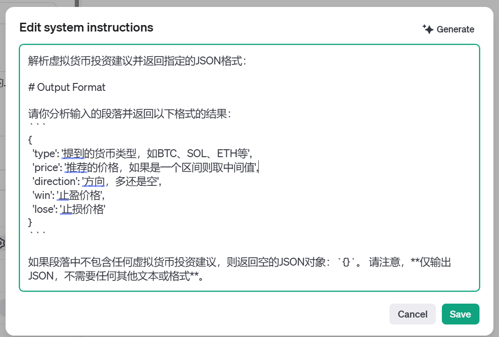

# my_openai_tool
use openai api to do something


监听tg上某人的消息，使用openai生成订单并在OKX上下单

压缩音频使其小于25MB，给openai whisper模型生成文本，输出到txt文件

注：需自行在https://platform.openai.com/playground/assistants
创建assistant并获取id

创建描述：

解析虚拟货币投资建议并返回指定的JSON格式：

# Output Format

请你分析输入的段落并返回以下格式的结果：
```
{
  'type': '提到的货币类型，如BTC、SOL、ETH等',
  'price': '推荐的价格，如果是一个区间则取中间值',
  'direction': '方向，多还是空',
  'win': '止盈价格',
  'lose': '止损价格'
}
```

如果段落中不包含任何虚拟货币投资建议，则返回空的JSON对象：`{}`。 请注意，**仅输出JSON，不需要任何其他文本或格式**。